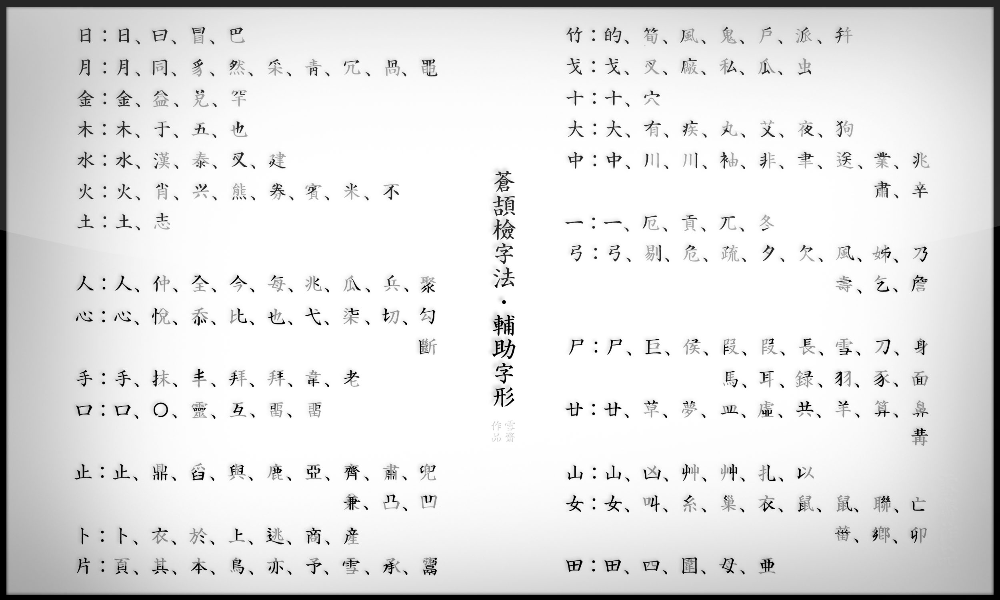

# 三碼蒼頡輸入法

配方： ℞ **lotem/rime-sancang**

[Rime](https://rime.im) 三碼蒼頡輸入方案

## 三碼蒼頡簡介

三碼蒼頡，由雪齋、惜緣等整理的 [蒼頡六代構詞碼碼表][1]
結合 [IDS data][2] 的漢字結構信息推導出來

原作爲朱邦復、沈紅蓮創造的蒼頡檢字法

[1]: https://github.com/LEOYoon-Tsaw/Cangjie6
[2]: https://github.com/cjkvi/cjkvi-ids

## 蒼頡字母變更

本方案在蒼頡六代基礎上做以下變更

  - 「竹」恢復爲基本字母
  - 「的」字改爲取碼「竹日心」

其他字母與輔助字形與蒼頡六代一致




## 取碼方法

每字取首、次、尾三碼

組合字分成字首、字身，取碼方法爲

  - 字首取首、尾二碼，字身取尾碼
  - 字首爲一碼盡取，字身取首、尾至多二碼

其他規則與蒼頡六代一致；唯每字「只取三碼」故，不需要考慮反字身規則

## 方案特點

本方案支持詞句連書、自動調整詞頻、記憶新詞

單碼字可綴以 `;` 或 `'` 鍵與後字的編碼隔開

以 <code>`</code> 鍵開始輸入拼音反查蒼頡碼

## 安裝

[東風破](https://github.com/rime/plum) 安裝口令： `bash rime-install lotem/rime-sancang`

## 安裝三碼蒼頡·簡化字方案

```
bash rime-install lotem/rime-sancang essay-simp pinyin-simp
bash rime-install lotem/rime-octagram-data@hans lotem/rime-octagram-data
```

``` yaml
patch:
  schema_list/+:
    - schema: sancang_simp
```

授權條款：見 [LICENSE](LICENSE)
